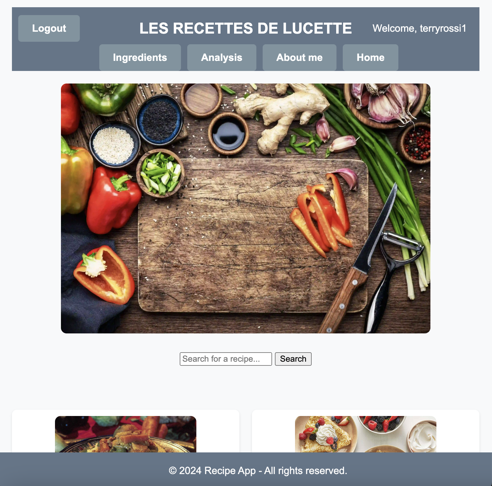
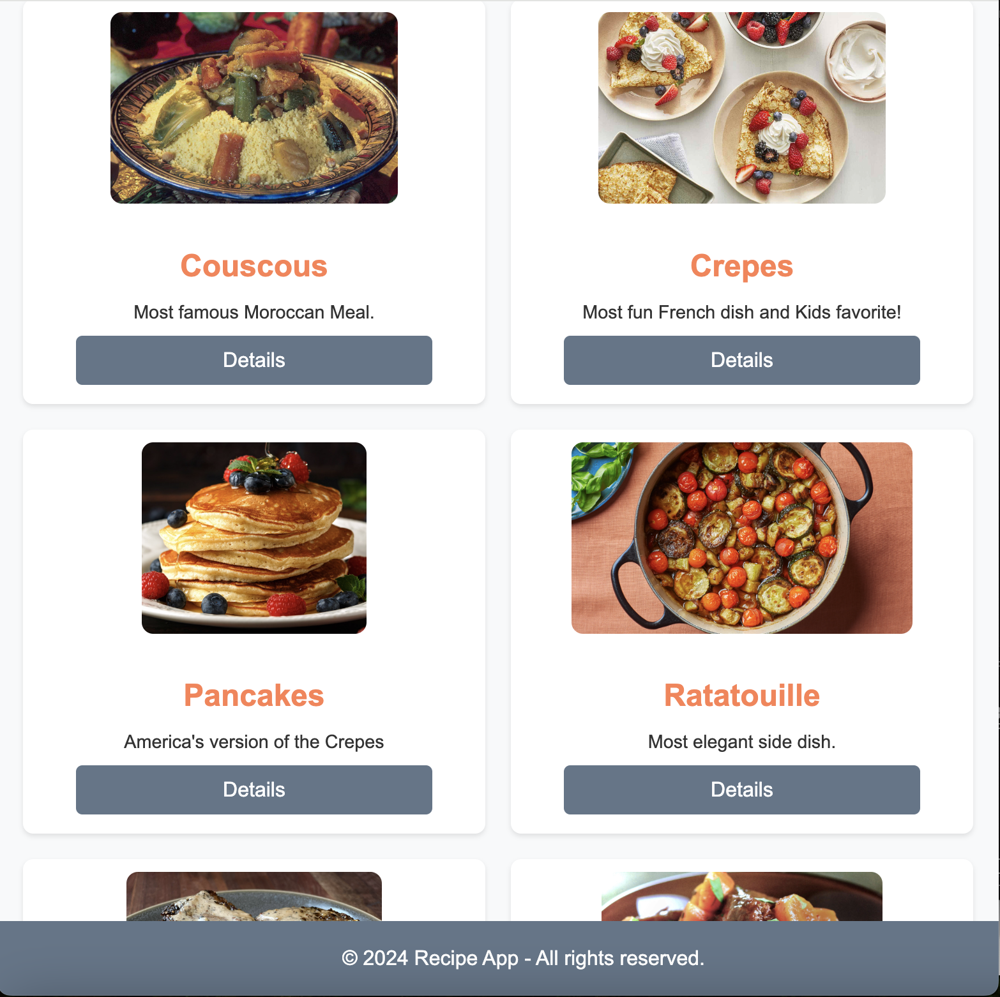
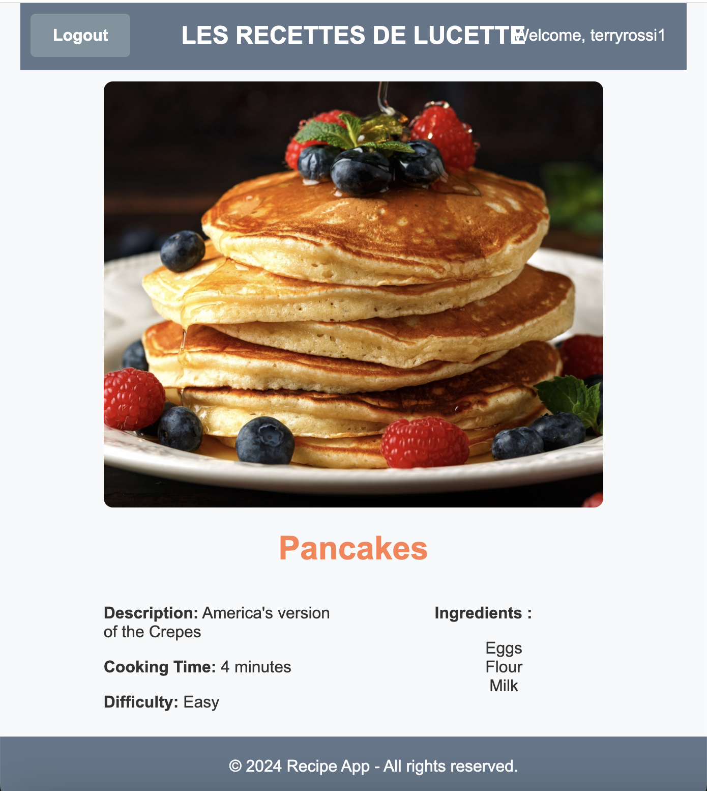
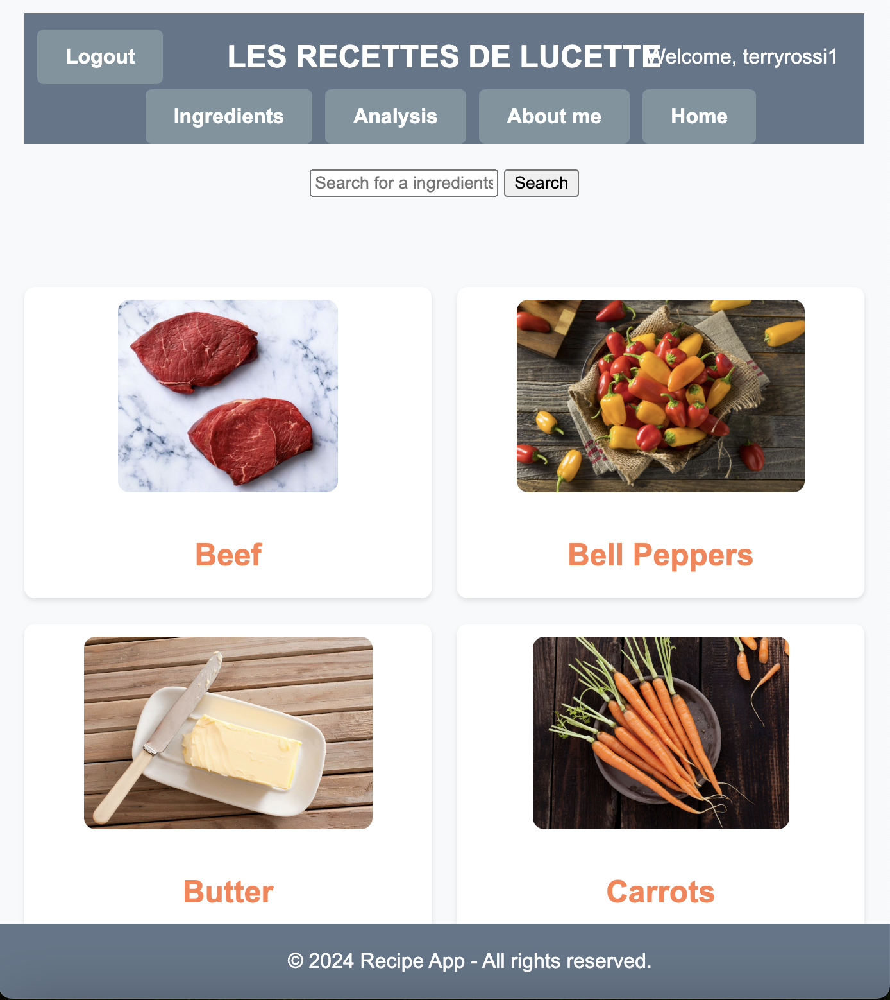
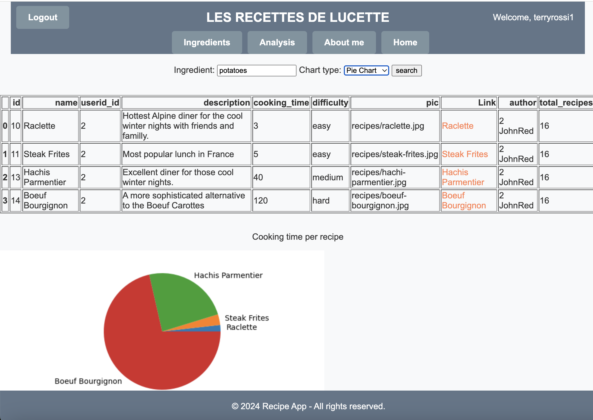
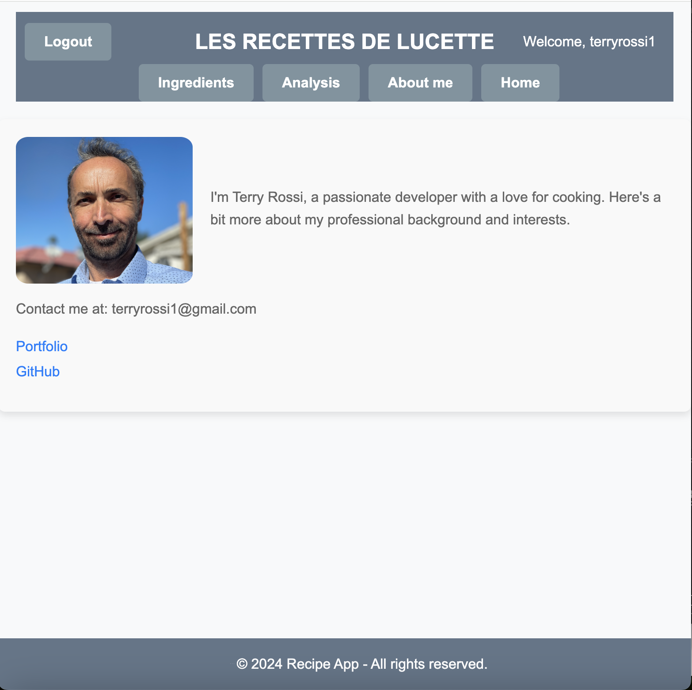

# recipe-app

Python/Django Recipes Project

# instructions on downloading and running the app locally on any machine

1. fork the repository from: https://github.com/terryrossi/recipe-app
2. Go to src folder
3. Create virtual environment: `mkvirtualenv recipe-app`
4. Install Django: `pip install django`
5. runserver: `python manage.py runserver`
6. Go to your localhost:8000

# Objective

In this project, we’ll take a Python Recipe app and use the
Django web framework to develop a fully fledged web application with multiple users and an admin panel.

# Context

This project focuses on creating a web application using the Django framework.
To work with Django, I need an understanding of application design patterns and internal language, which I gained in a previous project when using Python to make a command line Recipe app.
Now, I am rebuilding my app using Django. Django has the advantage of
being neatly moduralized and developer friendly, while also being powerful enough to run some of the world’s most popular websites.
In this project, working with Python-based Django, I am developping a full-stack web application using the Django development server. I’ll then deploy the application using Heroku, with a Postgres database at the backend, HTML, and CSS-based rendered pages at the frontend and Python-based Django as my web application framework.
My final web application will be dynamic and multi-user, letting users sign up and create their own content.
It’ll also have statistical dashboards, implementing my data analytics and data visualization skills. Finally, I’ll demonstrate coding best practices by putting my well-tested and well-documented code on GitHub.

# The 5 W’s

It’s crucial to know what I am creating, who for, and why. Here are the details.

1. Who? This project demonstrates my Python and Django skills to my professional network.
2. What? The project consists of making a fully functional Recipe web application, which can create, read, and modify recipes, and search for recipes based on ingredients. The web application includes an admin panel for data handling and visualization.
3. When? The code for the web application is hosted on a GitHub repository so it’s ready for viewing. The application is hosted on a public web server so that professional network have access to it.
4. Where? The Recipe application can be viewed from my GitHub repository. Viewers (i.e. potential collaborators) will be able to play around with the live Recipe application.
5. Why? This project helps me demonstrate in professional settings
   - my understanding of the fundamentals of the Django web framework,
   - my web application development skills using the Django web framework

# User Goals

Users are able to create and modify recipes containing ingredients, cooking time, and a difficulty parameter automatically calculated by the application. Users can also search for recipes by ingredient.

# Key Features

To achieve the user goals, the application needs the following features:

- Allow for user authentication, login, and logout.
- Let users search for recipes according to ingredients.
- Automatically rate each recipe by difficulty level.
- Receive user input and handle errors appropriately.
- Display more details on each recipe if the user asks for that.
- Add user recipes to a PostgreSQL database.
- Include a Django Admin dashboard for working with database entries.
- Show statistics and visualizations based on trends and data analysis.

# Technical Requirements

The finished application should meet the following technical requirements:

- Works on Python 3.6+ installations and Django version 3.
- Handles exceptions or errors that arise during user input, then displays user-friendly error messages.
- Connects to a PostgreSQL database hosted locally on the same system (a mySQL database is needed during the development of the application).
- Provides an easy-to-use interface, supported by simple forms of input and concise, easy-to-follow instructions. Menus containing features like login and logout must be presented neatly—with concise and easy-to-follow prompts.
- Code with proper documentation and automated tests is uploaded on GitHub. A “requirements.txt” file is provided, containing the requisite modules for the project.
- Readme file is provided with instructions on downloading and running the app locally on any machine.

# Installation Requirements

- pip install django
- In order to use Google Oauth for Login it is required to install django-allauth: pip install django-allauth
- pip install pandas
- pip install matplotlib

# Deployment on Heroku

- The project is Deployed on Heroku through it's conection to Github. So every commit is pushed to github and then to Heroku.
- 2 super users were created for maintenance.
- The original SQLite3 Database was converted to a PostgreSql DB for compatibility with Heroku.
- The Google Oauth sttings have been updated in the Dev console to accomodate Local and Production execution.
  **Google Oauth requires extra manipulation in admin. Must link social application with Google dev console Key and secret. Also need to match site_key in admin with settings.py**

# Additional tasks for Deployment

- Make sure to switch debug = True to False
- Make sure to change Secret_key in Heroku

# Link to the site: https://safe-atoll-52750-86a0b77e2141.herokuapp.com/

User: bobwhite/RecAppBw75

# Screen Shots:

